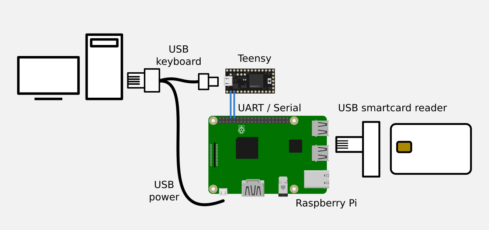
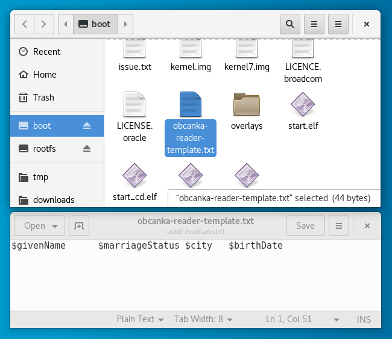

# obcanka-reader

A simple java app that runs on raspberry pi and uses https://github.com/ParalelniPolis/obcanka-public to read Czech ID smartcards


## Build
- `git clone git@github.com:ParalelniPolis/obcanka-public.git`
- `git clone git@github.com:premek/obcanka-reader.git`
- `cd obcanka-public`
- `ln -s ../obcanka-reader/raspberry/obcanka-reader/ obcanka-reader`
- edit `settings.gradle`
  - delete `android_app`, `android_lib` lines so you don't have to install android sdk
  - add `include ':obcanka-reader'`
- `./gradlew clean build shadowJar`

And copy `obcanka-reader/build/libs/obcanka-reader-all.jar` to Raspberry.

## HW
Tested with Teensy 3.0 and Raspberry Pi 3 Model B.

Teensy emulates the keyboard and is connected to the user PC via micro USB.

Raspberry Pi is connected to Teensy via UART / Serial line pins: 
 - Teensy pin 0 (RX1) to Raspberry GPIO pin 8 (UART0 TX)
 - Teensy pin 1 (TX1) to Raspberry GPIO pin 10 (UART0 RX)

Raspberry uses USB only for power.





## Installation

### Teensy
Install Arduino IDE and Teensyduino, see https://www.pjrc.com/teensy/teensyduino.html and upload the `teensy/serial-to-keyboard/serial-to-keyboard.ino` sketch into your Teensy.

### Raspberry Pi
- download and install Raspbian image (Lite version is enough), configure user/ssh access etc
- disable serial console using `raspi-config`
- `sudo aptitude install openjdk-8-jre-headless pcscd jq`
- copy the following files to `/home/pi` on Raspberry Pi
  - `obcanka-reader-all.jar`
  - `obcanka-reader-run.sh`
  - `obcanka-reader-template.txt`
  - `obcanka-reader.service`

#### auto-start
- `sudo mv obcanka-reader.service /lib/systemd/system/`
- `sudo chmod 644 /lib/systemd/system/obcanka-reader.service`
- `sudo systemctl daemon-reload`
- `sudo systemctl enable obcanka-reader.service`
- reboot

## Configuration
Emulated keyboard's output can be configured by editinag a file on Raspberry's SD card. This can be done on raspberry Pi directly or by using a SD card reader on your computer.
 
Edit (or create) the file named `obcanka-reader-template.txt` in the `/boot` partition.

Example:
```
$givenName  →  $surname↵
```



You can use any characters that would be typed directly (e.g. tab or spaces to separate fields) or the following variables that are read from the ID card.

- $serialNumber
- $cardID
- $documentNumber
- $givenName
- $surname
- $marriageStatus
- $sex
- $street
- $city
- $locality
- $countryName
- $countryCode
- $birthNumber
- $birthDate
- $birthCity
- $organization
- $dokState
- $dokTryLimit
- $dokMaxTryLimit
- $iokState
- $iokMaxTryLimit
- $iokTryLimit


